#  1시간만에 GAN(Generative Adversarial Network) 완전 정복하기

## Probability DIstribution (확률 분포)

실제 이미지에 대한 확률 분포(확률밀도함수)가 존재할 때 아래의 분포를 갖는다고 가정한다면,

 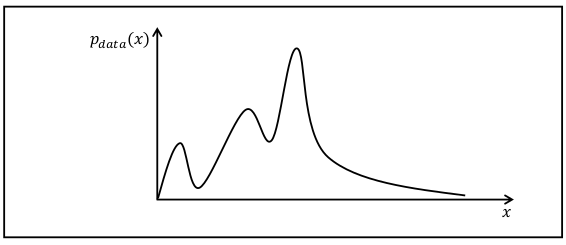

---

 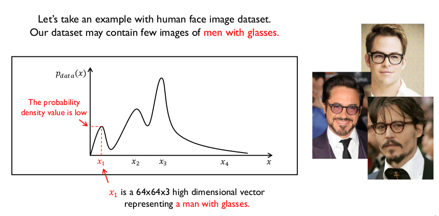

사람 얼굴 데이터 셋에서 *안경을 낀 남자*가 좀 상대적으로 적게 등장했다고 하면, 그 안경을 낀 남자에 해당하는 픽셀을 대표하는 값을 x1 의 어떤 벡터라고 했을때 그 x1에 해당하는 확률 밀도 값은 상대적으로 작게됩니다. 

 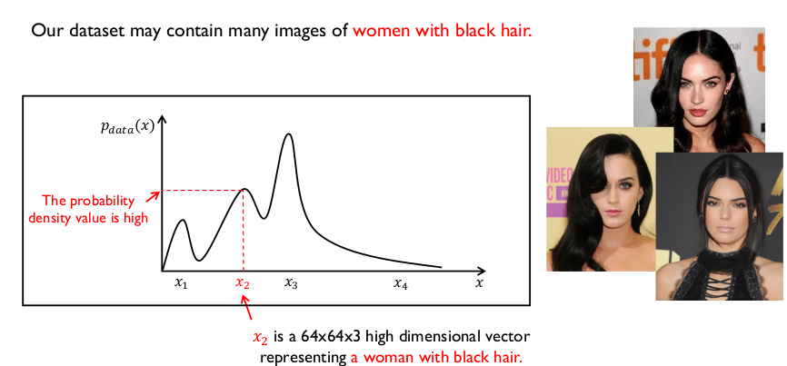

흑발의 여자는 안경을 낀 남자보다 학습데이터에서 비교적 많이 등장을 했다면, 흑발의 여자 이미지에 해당하는 확률 밀도 값은 상대적으로 높게 됩니다. 

 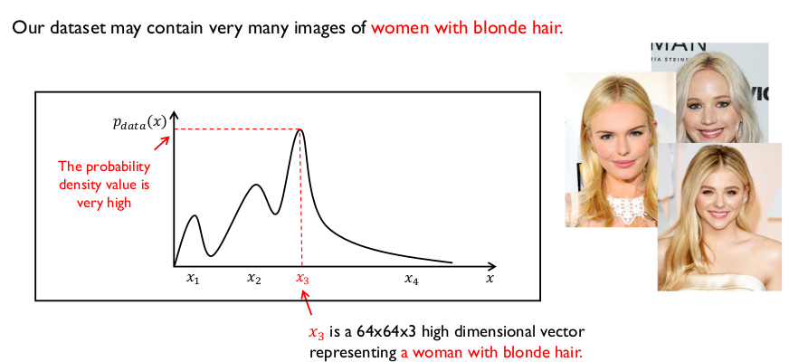

마찬가지로 금발의 여자 데이터가 많이 나왔다면 금발의 여자 데이터에 해당하는 벡터를 x3라고 했을 때 x3에 대한 확률 밀도값은 상당히 높게됩니다. (*예를 들어 1차원 상으로 설명되었지만, 실제로는 상당히 고차원입니다.*)

 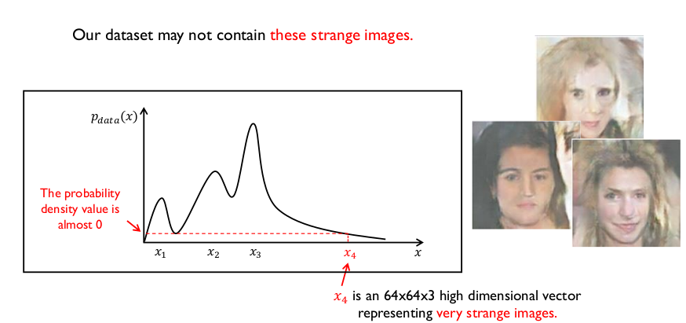

괴상한 이미지는 실제 학습 데이터에 존재할 수 없기 때문에 이를 x4라고 하면 이에 대한 확률밀도값도 굉장히 낮습니다. 이에 대한 64 x 64 x 3 크기의 고차원 벡터는 픽셀값이기 때문에 픽셀값들을 잘 조정하다보면, 이런 괴상한 이미지를 만들어 낼 수 있게 됩니다.

 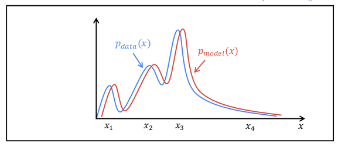

Generative Model 이 하고자 하는 목표가 이 시점에서 나오게 되는데, 파란 색이 실제 학습 데이터 셋의 분포이며, Generative Model은 실제 이 데이터의 분포를 잘 근사하는 모델을 만들고자 합니다. 빨간 색은 모델이 생성에 대한 이미지 데이터 분포라고 생각할 수 있습니다. **두개의 확률분포간의 차이를 줄여주는 게 이제 Generative Model의 목표입니다.**

## Generative Adversarial Networks (GAN)

##### Discriminator Model

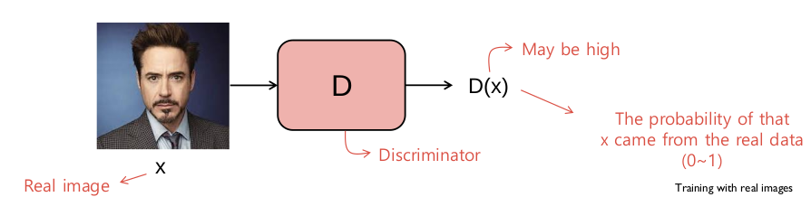

진짜 이미지를 진짜 이미지로 구별하고 **가짜 이미지를 가짜로 구별할 수 있도록 학습**합니다. 

* 입력 : 64 x 64 크기의 고차원 벡터
* 출력 : binary classification

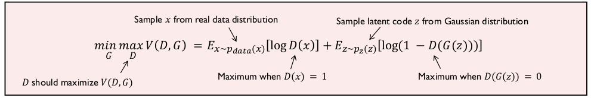

##### Generator

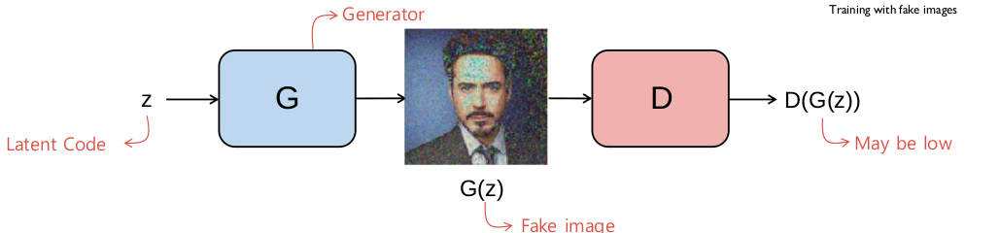

랜덤한 코드를 입력 받아서 이미지를 생성하고 **Discriminator를 속여야합니다.** Discrimator의 출력이 1이 나오도록 학습을 시켜야합니다. Generator가 학습을 할 수록 진짜같은 가짜 이미지를 만들어 내게 됩니다. 

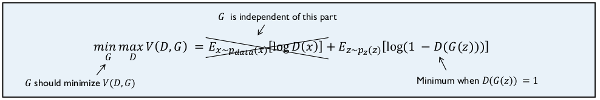

##### Code

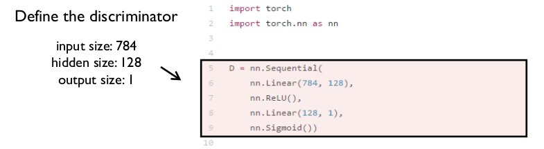

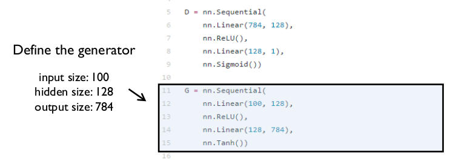

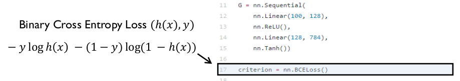

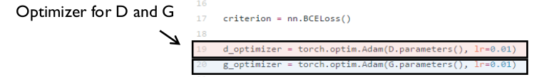

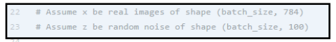

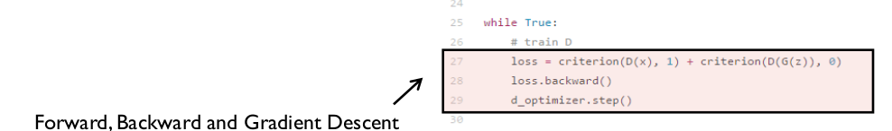

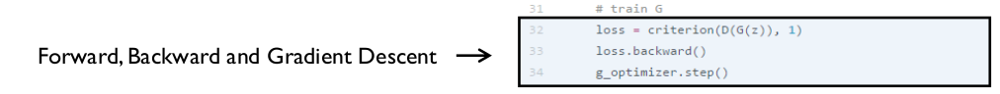

실제로 돌아가는 코드는 https://github.com/yunjey/pytorch-tutorial 레포지토리에 있습니다.

##### Non-Saturating Game

Generator는 처음에는 매우 형편없는 이미지를 만들게 됩니다. Discreminator의 입장에서는 이런 형편없는 이미지에 대해서 가짜임을 확신하게 됩니다. 그렇다면, **D(G(z))의 값이 0에 가깝게 된다.** 그런데 그때의 기울기가 생각보다 작습니다. (*아래의 그래프를 참고합니다.*)

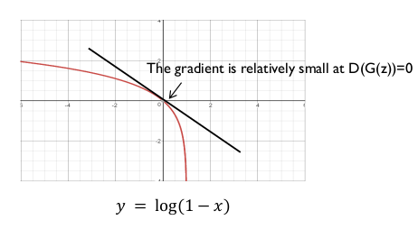

그래서 log(1 - x)를 최소화하는 것이 아니라 log(x)를 최대화하는 방향으로 바꾸게 됩니다. (Heuristically motivated)

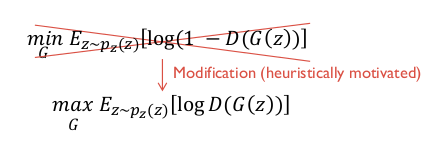

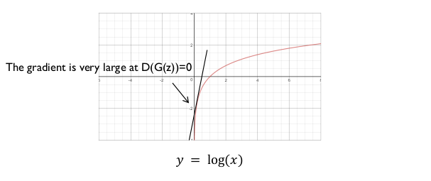

기울기가 무한대로 나오게 됩니다. Generator 의 결과물이 안좋은 상황을 최대한 빨리 벗어나려고 노력하려고 해서 **Discreminator가 햇갈려할만한 데이터를 생성**해내려고 하게 됩니다.

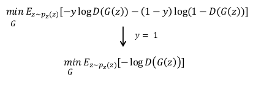

##### Theory in GAN

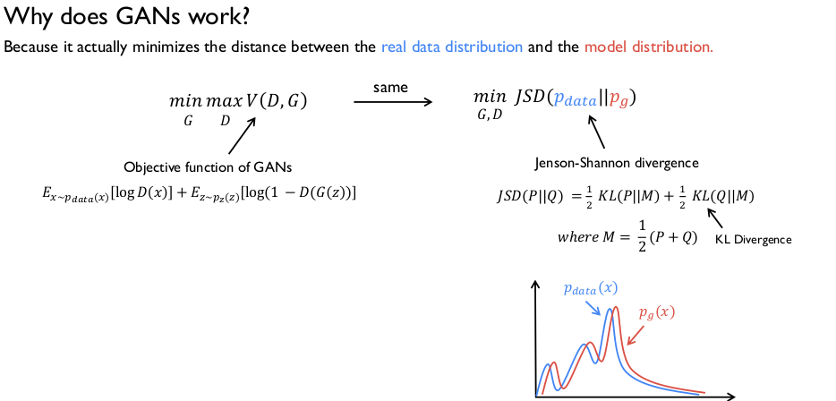

이론적으로 왜 GAN이 잘 작동하는지 : 최적화하는 것은 실제로 두 확률분포 간의 차이를 줄여주는 것이기 때문에 Generator가 진짜와 가까운 이미지를 만들 수있다.

## Varient of GAN

#### DCGAN(Deep Convolutional GAN, 2015)

Deep Convolutional Network를 통해서 Generator를 만들어냈다.

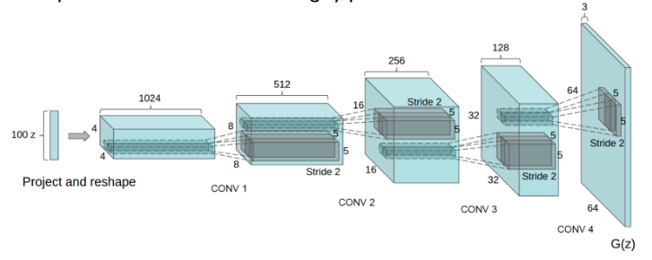

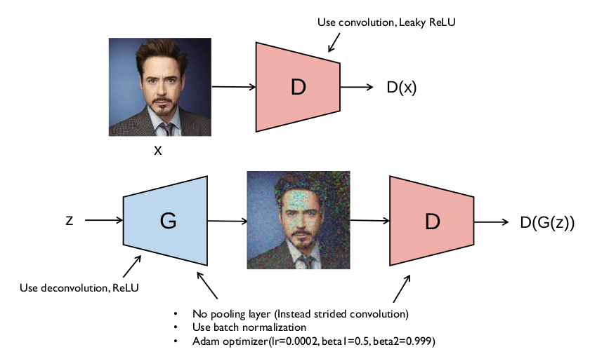

DCGAN에서의 핵심은 **Pooling Layer를 사용하지 않았다**는 것이다. Pooling Layer를 사용하게 되면 unpooling을 할 때의 결과물이 blocky하게 된다. 학습을 안정화시키기 위해서 Batch normalization을 적용하였으며, Adam optimizer를 사용하였다. 

64 x 64크기의 이미지를 만들 때 보통 4개의 Convolutional Layer를 이용해서 만들게 되는데, 저 term들의 결과가 좋게 나온다. 다른 논문들에서도 저 값을 고정적으로 사용한다.

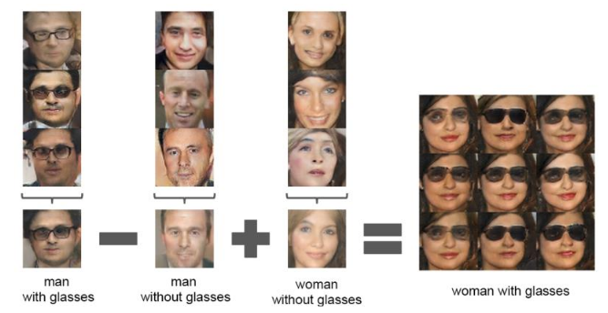

DCGAN에서 하나 더 재밌는 포인트는, Generator의 인풋으로 들어가는 Latent vector의 **산술적 연산이 가능하다**는 점이다. 

